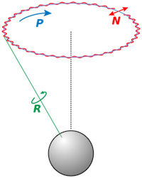

.. _astro_service:

Astro Service
=============

The `astro-service <../../doxygen/html/group__astro__xforms.html>`_ project
provides an interface to astronomical transformations, the positions of the
Moon and Sun, and a calculation of the strength of the geomagnetic field.  A 
`standard implementation <../../doxygen/html/classStdAstroService.html>`_ of the
interface is provided and should be sufficient for most users.

.. contents:: 
   :local:
   :backlinks: top

Astronomical Transformations
----------------------------

Astronomical transformations are central to the analysis of gamma-ray sources,
so a standard interface for astronomical calculations is provided in this
project.  This includes support for multiple coordinate systems and
transformations between them.  Of most use to users are transformations
between detector (or Local) coordinates and sky (or Equatorial) coordinates.  

Coordinate Systems
^^^^^^^^^^^^^^^^^^

.. figure:: coords.png
   :align: center
   :height: 240px
   :figclass: align-center

   **Left**: The local horizon coordinate system, a left-handed system defined
   by a local azimuth :math:`A` and altitude angle :math:`a`. **Center**: the
   equatorial coordinate system (red), defined by an azimuth angle
   :math:`\alpha` and a latitude :math:`\delta`. **Right**: the relationship
   between equatorial coordinates (red) and galactic coordinates (blue), which
   are defined by a longitude :math:`l` and a latitude :math:`b`.

*Local*
   A right-handed coordinate system with local azimuth defined with respect to
   East.  This is a standard "physicist" coordinate system fixed on the
   detector, and used to define vectors such as shower axes before they are
   transformed to sky coordinates.

*Horizon*
   A left-handed coordinate system with local azimuth defined with respect to
   South. This coordinate system is commonly used in astronomical
   transformations and is used internally in several functions in
   ``astro-service``.  It is likely not of much use for most AERIE users.

*Equatorial*
   A coordinate system defined by the projection of the Earth's equator and
   poles onto the celestial sphere. The azimuth is called right ascension (RA)
   and the zenith (actually a latitude) is called declination (Dec).
   Equatorial coordinates drift over time due to the `precession of the
   equinoxes <http://en.wikipedia.org/wiki/Precession#Astronomy>`_ and so are
   typically expressed in a standard `astronomical epoch
   <http://en.wikipedia.org/wiki/Epoch_(astronomy)>`_.  This is the most
   commonly used coordinate system for the analysis of gamma-ray sources.

*Ecliptic*
   A celestial coordinate system whose equator is defined by the ecliptic plane
   of the solar system.  It is not generally used in HAWC but is relevant for
   the analysis of phenomena specific to the heliosphere, like solar flares.

*Galactic*
   A celestial coordinate system centered on the sun, with its equator defined
   by the Galactic Plane.  This coordinate system is very convenient for
   defining Galactic and Extragalactic objects, and is defined by a fixed
   transformation from Equatorial coordinates.

Precession and Nutation Effects
^^^^^^^^^^^^^^^^^^^^^^^^^^^^^^^

`Precession <http://en.wikipedia.org/wiki/Precession#Astronomy>`_ is a change
in the orientation of the axis of rotation of the Earth, causing it to trace
out a 23 degree cone during the full precessional cycle.  The Earth's axis
precesses at a rate of about 0.1 degree per decade, which is comparable to the
angular resolution of the HAWC reconstruction at high energies.  Therefore, it
is an effect we need to account for over the life of the HAWC experiment.

   The rotation of the Earth about its axis (green) precesses in a 20,000-year
   cycle (blue). Nutation (red) is a small "wobble" caused by the perturbations
   of other bodies in the Solar System.

The practical consequence of precession is that all Equatorial coordinates
needed to be rotated (or "precessed") to the `J2000 astronomical epoch
<http://en.wikipedia.org/wiki/Epoch_(astronomy)>`_ in order to be compared to
Equatorial measurements from other experiments. In other words, reported
Equatorial positions are rotated back to the coordinates in the sky where they
would have appeared in the year 2000, but no longer do because of the
precession of the Earth's rotation.

`Nutation <http://en.wikipedia.org/wiki/Nutation#Of_the_Earth>`_ is a
small correction to the precession of the Earth's axis caused by gravitational
perturbations from other bodies in the solar system.  It appears as a small
"wobble" in the precession of the Earth's axis.  While the effect is likely too
small to make much difference in HAWC analysis, we calculate it for
completenes.

Lunar and Solar Positions
^^^^^^^^^^^^^^^^^^^^^^^^^

The positions of the Sun and Moon are calculated using the series expansions
provided in Meeus' *Astronomical Algorithms* [Mee2004]_. These are used for
physics and calibration analysis such as the observation of the shadow of the
Moon and Sun in cosmic rays.

Geomagnetic Field
^^^^^^^^^^^^^^^^^

An interface is provided for a calculation of the strength of the geomagnetic
field given a geocentric position and a time.  Implementations of the interface
include a simple dipole field and a multipole expansion provided by the
International Geomagnetic Reference Field or IGRF [Fin2010]_.

Examples
--------

C++ Example
^^^^^^^^^^^

The astro number services are registered with the :ref:`hawcnest` framework
and can be instantiated as follows:

.. code-block:: c++

   #include <hawcnest/HAWCNest.h>
   #include <rng-service/AstroService.h>

   ...

   int main()
   {
     // Create the framework instance and initialize the Astro service
     HAWCNest nest;
     nest.Service("StdAstroService", "astroX");
     nest.Configure();

     // Get a reference to the astro service
     const AstroService& astroX = GetService<AstroService>("astroX");

     // Define a locale, a time, and a local coordinate vector
     LatLonAlt locale(18.99*degree, -97.31*degree, 4100*meter);

     Vector axis;
     axis.SetRThetaPhi(1., 11.97*degree, 23.46*degree);

     UTCDateTime t(2007,10,4, 3,3,3);     // 4 Oct 2007, 03:03:03 UT
     ModifiedJulianDate mjd(t);

     // Convert local to equatorial coordinates
     EquPoint equ;
     astroX.Loc2Equ(mjd, locale, axis, equ);

     return 0;
   }

Python Example
^^^^^^^^^^^^^^

Python bindings to the astro-service are also available.  The syntax is almost
the same as in C++.

.. code-block:: python

   from hawcnest import hawcnest, data_structures, astro_service
   from hawc.hawcnest import HAWCUnits as U
   from hawc.data_structures import *
   from HAWCNest import HAWCNest

   # Create the framework instance and initialize the RNG service
   nest = HAWCNest()
   nest.Service("StdAstroService", "astroX")
   nest.Configure()

   # Get a reference to the astro service
   astroX = astro_service_GetService("astroX")

   # Define a locale, a time, and a local coordinate vector
   locale = LatLonAlt(18.99*U.degree, -97.31*U.degree, 4100*U.meter)

   axis = Vector()
   axis.r_theta_phi = (1., 11.97*U.degree, 23.46*U.degree)

   utc = UTCDateTime t(2007,10,4, 3,3,3)     # 4 Oct 2007, 03:03:03 UT
   mjd = ModifiedJulianDate(t)

   # Convert local to equatorial coordinates
   equ = EquPoint()
   astroX.Loc2Equ(mjd, locale, axis, equ)
   ...
