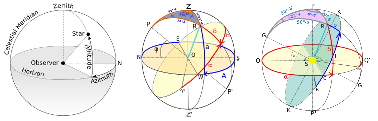

.. _data_structures_astronomy:

Astronomy Classes
=================

.. contents::
   :local:
   :backlinks: top

The astronomy data structures inherit from the geometry class `S2Point
<../../doxygen/html/classS2Point.html>`_ and represent angular coordinates in
several astronomical systems.

EclPoint.h    EquPoint.h    GalPoint.h    HorPoint.h

   The astronomy data structures provide coordinate representations of
   positions in local coordinates (left), equatorial coordinates (center), and
   galactic coordinates (right).

The supported astronomical coordinates include

#. `HorPoint <../../doxygen/html/classHorPoint.html>`_, a left-handed azimuth-elevation coordinate system with zero azimuth defined as grid South.
#. `EquPoint <../../doxygen/html/classEquPoint.html>`_, the representation of coordinates on the celestial sphere (right ascension for azimuth, declination for elevation).
#. `GalPoint <../../doxygen/html/classGalPoint.html>`_, the representation of coordinates with the plane of the Galaxy defining azimuth (galactic longitude) and the direction normal to the plane defining elevation (galactic latitude).
#. `EclPoint <../../doxygen/html/classEclPoint.html>`_ to represent coordinates with the ecliptic plane of the Sun defining the longitude.

Transformations between the various coordinate systems are implemented in the
:ref:`astro_service` project.
