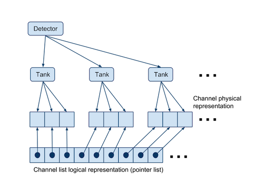

.. _data_structures_detector:

Detector Classes
================

.. contents::
   :local:
   :backlinks: top

The detector classes are split into two parts:

#. A representation of physical PMTs and Tanks and the detector geometry itself for use in simulation and reconstruction.
#. A representation of electronics components for use in more detailed electronics simulations

Geometry Structures
-------------------

Photomultiplier
^^^^^^^^^^^^^^^

The geometrical and electronics properties of photomultipliers is represented
by the `PMT <../../doxygen/html/classdet_1_1PMT.html>`_ class.  PMT properties
include

* Height and diameter of the base and glass envelope
* PMT type (R5912, R7081-HQE, etc.)
* PMT gain, single PE amplitude, and single PE signal width
* PMT output impedance

Water Cherenkov Detector
^^^^^^^^^^^^^^^^^^^^^^^^

A water Cherenkov detector (WCD) is represented by the class
`Tank <../../doxygen/html/classdet_1_1Tank.html>`_. The WCD is composed of a
steel tank, the water inside it, and a group of PMTs inside the water.

The Tank contains a list of `Channels
<../../doxygen/html/classdet_1_1Channel.html>`_ which represent physical slots
inside the Tank where PMTs are plugged in. The Tanks also contain information
about their position in the detector coordinate system (a Point object from the
:ref:`data_structures_geometry`).

Each Channel gets a unique ID within the tank and a global ID within the
detector as a whole.  Iterators are provided to loop over the Channels.  Each
Channel knows its ID numbers, position in the detector, and connected PMT.

Full Detector
^^^^^^^^^^^^^

The `Detector <../../doxygen/html/classdet_1_1Detector.html>`_ class contains a
list of Tanks, each of which contains a list of Channels with associated PMTs.
Iterators are provided to loop over Tanks or Channels themselves.  The Detector
also stores information about its position (a LatLonAlt object from the
:ref:`data_structures_geometry`).

   In-memory representation of a Detector composed of Tanks.  Each Tank
   includes a list of Channels.  At the level of the Detector class, a
   pointer array is provided for fast iteration over Channels as well as Tanks.

Electronics Simulation
----------------------

Several classes are used to store component properties useful for a full
simulation of the PMT signal traces, their transmission to the front-end
electronics, and the construction of time-to-digital converter (TDC) edges in
the electronics.  These properties are used to simulate the dispersion and
discrimination of PMT signals in the :ref:`electronics_simulator`.

CoaxialCable
^^^^^^^^^^^^

The `CoaxialCable <../../doxygen/html/classCoaxialCable.html>`_ class defines
the length of cables from the PMTs to the front-end electronics and the
following electronics properties:

* Capacitance per unit length
* Cable propagation velocity
* Signal attenuation in dB per 100 m or ft at some fixed frequency

Front-End Board
^^^^^^^^^^^^^^^

The `ABChannel <../../doxygen/html/classdet_1_1ABChannel.html>`_ describes the
electronic settings of an analog channel on the analog card of the Front-End
Boards used to read out the PMTs.  Logically, the analog channels are composed
of three parts:

#. An operational amplifier that shapes and amplifies the signal.
#. An RC integrator.
#. A voltage discriminator.

This class defines the transconductance *g*\ :sub:`m` of the op-amp, the
resistance *R* and capacitance *C* of the integrator circuit, and the voltage
threshold of the channel discriminator.

An `AnalogCard <../../doxygen/html/classdet_1_1AnalogCard.html>`_ class
contains a low and high threshold ABChannel with different discriminator and
gain settings.

Finally, an `FEBoard <../../doxygen/html/classdet_1_1FEBoard.html>`_ class
contains an AnalogCard and defines the capacitance *C* of the DC blocking
capacitor at the board input and the resistance of the terminating resistor
*R*. An estimate of the voltage noise density of the board is also provided and
can be used to introduce realistic noise to the integrated signals during the
electronics simulation.
