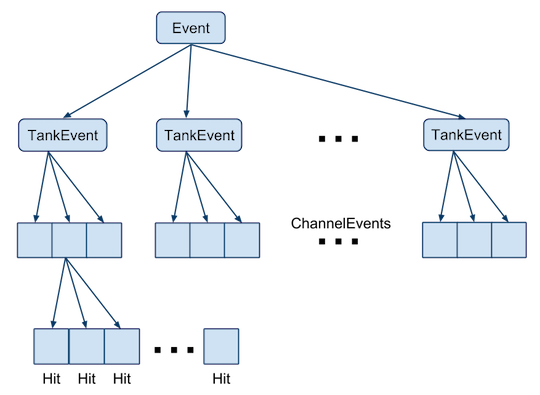
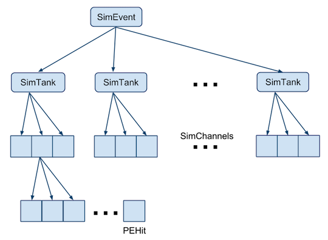

.. _data_structures_event:

Event Classes
=============

.. contents::
   :local:
   :backlinks: top

The event data structures are a hierarchical set of classes which represent the
categorization of the data.  They are organized into two components: `Events
<../../doxygen/html/classevt_1_1Event.html>`_ for data from the detector, and
`SimEvents <../../doxygen/html/SimEvent_8h.html>`_ for simulation.

Events from Data
----------------

The `Event <../../doxygen/html/classevt_1_1Event.html>`_ hierarchy stores the
data in a manner that reflects the physical layout of the detector.  The
top-level Event class contains a list of `TankEvents
<../../doxygen/html/classevt_1_1TankEvent.html>`_.  Each TankEvent contains a
list of `ChannelEvents <../../doxygen/html/classevt_1_1ChannelEvent.html>`_.
Each ChannelEvent contains a list of PMT `Hits
<../../doxygen/html/classevt_1_1Hit.html>`_.  And each Hit contains a list of
`Edges <../../doxygen/html/classevt_1_1Edge.html>`_ from the time-to-digital
converters (TDCs) in the front-end electronics.

   Representation of an Event in memory.  Events store data from tanks in
   TankEvents; tanks store data from PMTs in ChannelEvents; channels store
   lists of Hits.

Associated with Hits are flags related to the state of the electronics during
the recording of the Event, as well as the categorization of the data by the
calibration and reconstruction algorithms.  Hit data are split into two
components:

#. Triggered Hit data stored in the `HitTrigData <../../doxygen/html/classevt_1_1HitTrigData.html>`_ class.
#. Calibrated Hit data stored in the `HitCalData <../../doxygen/html/classevt_1_1HitCalData.html>`_ class.

The :code:`HitTrigData` stores the "raw" information from the HAWC TDCs,
meaning the :code:`Edge` pattern and the categorization of the :code:`Hit` by
the edge finding algorithms (good hit, afterpulse, etc.).

The :code:`HitCalData` stores the calibrated hit information, meaning the time
of the hit (corrected for time PMT timing offsets using the calibration
database) and the estimated number of photoelectrons (PEs) corresponding to the
time over threshold in the :code:`Edge` list for this hit. The calibrated hit
data are used directly by reconstruction algorithms.

Simulated Events
----------------

The hierarchy of simulated events is quite similar to that in data. A `SimEvent
<../../doxygen/html/classSimEvent.html>`_ contains a list of `SimTanks
<../../doxygen/html/classSimTank.html>`_. Each SimTank contains a list of
`SimChannels <../../doxygen/html/classSimChannel.html>`_, and a SimChannel
contains a list of `PEHits <../../docs/doxygen/html/classPEHit.html>`_. The
PEHits store charge and hit time data directly from the simulation.

   Representation of a simulated event (SimEvent) in memory.  SimEvents store
   data from tanks in SimTanks; tanks store data from PMTs in SimChannels;
   channels store lists of PEHits.

When simulated data are read into AERIE, the PEHits are smeared by the timing
and charge resolution of the PMTs, and additional noise hits are added (see
:ref:`sim_pmt_modeler` for details). The resulting charge data are pushed into
the `HitCalData <../../doxygen/html/classevt_1_1HitCalData.html>`_ in the
:code:`Event` class, which is accessed by the reconstruction code.

In this manner, the same reconstruction algorithms can be applied equally to
both data and simulation. The difference between data and simulation occurs at
the level of input and calibration, before core fitting and track fitting
algorithms are applied.
