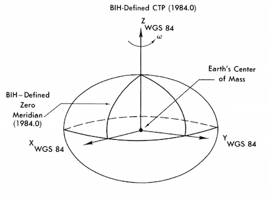

.. _data_structures_geometry:

Geometry Classes
================

.. contents::
   :local:
   :backlinks: top

Vectors and Matrices
--------------------

Several classes are provided to enable a complete set of coordinate
transformations and representations of vectors in R3 and on the unit sphere in
Cartesian, Spherical, and Cylindrical coordinates.  These classes are used
extensively in air shower reconstruction.

The classes borrow heavily from a similar geometry library in the offline
software of the Pierre Auger Observatory and the CLHEP/GEANT4 package.

Vector
^^^^^^

The `Vector <../../doxygen/html/classVector.html>`_ class defines an object in
R3 that has a magnitude and direction and can be added to other Vectors using
vector algebra.  Vector norms, addition, subtraction, scaling, rotation, and
multiplication (dot and cross products) are provided.  Details are given in the
`doxygen documentation <../../doxygen/html/classVector.html>`_.

Vectors can be represented and initialized in Cartesian, Spherical Polar, or
Cylindrical Polar coordinates.

Axial Vector
^^^^^^^^^^^^

The `AxialVector <../../doxygen/html/classAxialVector.html>`_ class transforms
like a Vector under rotation, but flips signs under reflections.  I.e., it is a
pseudovector.

Point
^^^^^

A `Point <../../doxygen/html/classPoint.html>`_ represents a point in 3D
space expressed with respect to a particular coordinate origin.  Points
transform like ordinary vectors.

S2Point
^^^^^^^

The `S2Point <../../doxygen/html/classS2Point.html>`_  class represents a
position on the unit sphere, and is equivalent to a Vector of unit length
expressed in Spherical Polar coordinates. This class is highly convenient for
representing directions and is used extensively in the shower geometry and
detector reconstruction classes.

Rotation and Translation
^^^^^^^^^^^^^^^^^^^^^^^^

Support for transformation matrices is provided in three classes:

#. `Rotate <../../doxygen/html/classRotate.html>`_, an implementation of orthogonal rotations.
#. `Scale <../../doxygen/html/classScale.html>`_, an implementation of scaling along several axes at once.
#. `Translate <../../doxygen/html/classTranslate.html>`_, a translation along one or more coordinate axes.

The WGS 84 Ellipsoid
--------------------

   The WGS 84 coordinate system, which represents the squashed ellipsoidal
   shape of the Earth.

Locations on the surface of the Earth are defined by the `WGS 84 ellipsoid
<http://en.wikipedia.org/wiki/World_Geodetic_System>`_, a standard spheroidal
reference system for the surface of the Earth.  On the reference ellpsoid, two
coordinate systems are supported:

#. `UTMPoint <../../doxygen/html/classUTMPoint.html>`_, an implementation of Universal Transverse Mercator coordinates, a gridlike system on the ellipsoid used in surveying.
#. `LatLonAlt <../../doxygen/html/classLatLonAlt.html>`_, an implementation of latitude and longitude on the surface, which can be converted to UTMPoint and back if needed.

These two classes are used to represent the position of the detector and are
useful in astronomical conversions between local coordinates and sky
coordinates.
