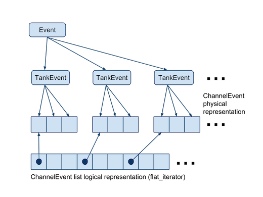

.. _data_structures_iterator:

Iterator Classes
================

.. contents::
   :local:
   :backlinks: top

The iterator classes contain two utility classes that aid access to the
:ref:`data_structures_detector` and :ref:`data_structures_event`:

#. :code:`flat_iterator`
#. :code:`selection_iterator`

Flat Iterator
-------------

The `flat_iterator <../../doxygen/html/classflat__iterator.html>`_ class
defines a forward iterator over the bottom level of a nested structure. The
iterator can be used to logically "collapse" a nested set of classes into a
flat data structure.

For example, in the object hierarchy representing :ref:`data_structures_event`,
Events are represented in the nested structure

.. code:: C++

   Event->TankEvent->ChannelEvent

A :code:`flat_iterator` can be defined in the :code:`Event` class to provide a
single loop over :code:`ChannelEvents`.  This avoids the need to nest loops
over :code:`TankEvents` and :code:`ChannelEvents` if one just wants to access
:code:`ChannelEvents`.  This offers considerable simplification of user code
that just needs to loop over channels.

A representation of the memory structure in a :code:`flat_iterator` is shown
below.

   The :code:`flat_iterator` applied to Event data.  ChannelEvent data are
   split among TankEvents, but the flat iterator presents the Event class with
   an apparently contiguous list of ChannelEvents.

Selection Iterator
------------------

The `selection_iterator <../../doxygen/html/classselection__iterator.html>`_ 
applies a selection function (or function object) while iterating over a list
of objects.  From the perspective of the average user, the iterator only
provides access to elements where a given comparison evaluates to :code:`true`.

For example, if one defines a list

.. code:: C++

   int array[10] = { 1, 2, 3, 4, 5, 6, 7, 8, 9, 10 };

a :code:`selection_iterator` could be defined to loop over only the even
elements in the list, or the odd elements, or only elements whose values are
greater than 4, and so on. Note that a similar filtering iterator is also
provided in the `Boost <http://www.boost.org>`_ C++ library.

